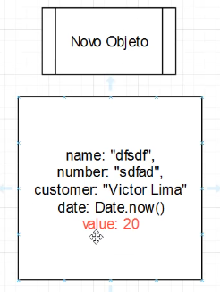

# Como escrever funções limpas

Criando funções limpas você garante que todo o seu projeto


**Bloco com dencidade lógica**: pequeno pedaço dentro do seu projeto onde tem
muita lógica importante.

A pergunta que deve ser feita ao análisar se um bloco precisa ou não
melhorar é: Você consegue entender o que esse bloco está fazendo em menos
de **10 segundos**?
```
let liquidValue = invoice.value - sharedTax;
invoice.value = liquidValue - generalTax - cityTax - companyTax;
invoice.value = invoice.value - platformFixedTax;
invoice.value = invoice.value - (invoice.value * discountPercentage);
return invoice;
```

A ideia do **clean code** é você fazer um código tão limpo e tão expressivo que 
só de bater o olho deve ser possível entender tudo que está acontecendo.

Para isso podemos separar o código denso em funções, a forma ideal de separar em
funções é tendo uma função para cada coisa, uma função com uma única responsabilidade.

```
invoice.value = GetLiquidValue(invoice.value);
invoice.value = GetTaxDeductedValue(invoice.value, invoice.document);
invoice.value = GetValueDeductedByPlatformTaxes(invoice.value);
invoice.value = GetValueDeductedByDiscount(invoice.value);
return invoice;
```

Sempre que for construir novas funções tente deixar uma única responsabilidade
para a função.

```
function GetLiquidValue(value){
const retailerId = "5678";
const platformId = "4567";
let  = GetSharedTax(retailerId, platformId);

return value - sharedTax;
}
```

```
function GetTaxDeductedValue(value, document){
let generalTax = GetTaxValueById(document);
let cityTax = GetTaxaMunicipalById7(document);
let companyTax = GetTaxaDaCompany(document);

return value - generalTax - cityTax - companyTax;
}
```

```
function GetValueDeductedByPlatformTaxes(value){
const platformFixedTax = 3.50;

return value - platformFixedTax;
}
```

```
function GetValueDeductedByDiscount(value){
const discountPercentage = 0.3;

return value - (value * discountPercentage);
}
```

# Objetos como parâmetros

Qual é o número ideal de parâmetros em uma função ?

Isso varia de linguagem para linguagem principalmente se estivermos trabalhando
com uma linguagem *tipada* com o c# e o java tanto faz o número de parâmetros, 
porque as IDEs dessas linguagens ajudam bastante na hora de setar parâmetros.

No caso do javascript que é uma linguagem dinâmica, você ter muitos parâmetros
atrapalha bastante a questão da chamada da função.

Exemplo: 

```
CalculateTax(invoiceName, document,value,customer,date)
```

```
CalculateTax("abc", "12355",30,"Cesar Augusto",Date.now());
```

As vezes fica dificil adivinha quais parâmetros temos que colocar porque o 
auto-complete das IDEs do javascript não ajudam muito.

O ideal é que cada função receba no máximo 2 parâmetros, se uma função precisar
receber mais de 2 parâmetros o ideia seria **receber um objeto**.

Observação: Sempre que você receber um objeto dentro de uma função tente não 
alterar esse objeto dentro da função.

```
function CalculateTax(purchase){

let invoice = {
    name: purchase.name,
    date: purchase.date,
    number: purchase.number,
    value: purchase.value,
    customer: purchase.customer
}
```
Chamada da função:
```
let purchase = {
    name: "ABC",
    date: Date.now(),
    number: "2323",
    value: 120,
    customer: "Cesar Augusto"
}

CalculateTax(purchase);

```

Podemos melhorar ainda mais essa função usando o *Spread Operator* do javascript.

Trocando isso:
```
let invoice = {
    name: purchase.name,
    date: purchase.date,
    number: purchase.number,
    value: purchase.value,
    customer: purchase.customer
}
```
Por isso:
```
let invoice = {...purchase};
```

# Parâmetros inteligentes

Podemos usar o *Destructuring assignment* do JavaScript para passar disso:

Função **sem o uso** do destructuring:
```
function CalculateTax(purchase){
    let invoice = {...purchase};
   
    invoice.value = GetLiquidValue(invoice.value);
    invoice.value = GetTaxDeductedValue(invoice.value, invoice.document);
    invoice.value = GetValueDeductedByPlatformTaxes(invoice.value);
    invoice.value = GetValueDeductedByDiscount(invoice.value);
    return invoice;
}
```

```
function GetLiquidValue(value){
    const retailerId = "5678";
    const platformId = "4567";

    let  = GetSharedTax(retailerId, platformId);
    return value - sharedTax;
}
```


função **com o uso** do destructuring:

```
function CalculateTax(purchase){
    let invoice = {...purchase};
   
    invoice.value = GetLiquidValue(invoice);
    invoice.value = GetTaxDeductedValue(invoice);
    invoice.value = GetValueDeductedByPlatformTaxes(invoice);
    invoice.value = GetValueDeductedByDiscount(invoice);
    return invoice;
}
```

```
function GetLiquidValue({value}){
    const retailerId = "5678";
    const platformId = "4567";

    let  = GetSharedTax(retailerId, platformId);
    return value - sharedTax;
}
```

### Valor padrão (opcional)
Imaginando que foi pedido para criar uma função que se o input de **b**
for **nulo** ou seja se a pessoa não passar **b** diga que b é igual a **30**.
Se a pessoa não passar **a** diga que a é igual a **20**. 

Muito programador faz isso:
```
function Teste(a,b){
    if(b == undefined){
        b = 30;
    }

    if(a == undefined){
        a = 20;
    }
}
```

O certo é passar um valor padrão.
```
function Teste(a = 20,b = 30){}
```

Vamos supor que dentro da função **CalculateTax** recebemos um objeto
super complexo que é o **purchase** e se acontecer de dentro desse objeto
não ter um campo específico?

Exemplo, aqui a pessoa não está passando o **value**:
```
CalculateTax({
    name: "ABC",
    date: Date.now(),
    number: "2323",
    customer: "Cesar Augusto"
});
```

Cada função deve ter seu valor padrão para caso a pessoa
deixar de passar um valor. Então podemos usar o
método **assing** para mesclar os dois objetos.

```
function CalculateTax(purchase){

    let defaults = {
        name: "ABC",
        number: "2323",
        value: 0,
        customer: "Loren",
        date: Date.now()
    }

    let invoice = {...purchase};

    invoice = Object.assign(defaults, invoice);

    invoice.value = GetLiquidValue(invoice);
    invoice.value = GetTaxDeductedValue(invoice);
    invoice.value = GetValueDeductedByPlatformTaxes(invoice);
    invoice.value = GetValueDeductedByDiscount(invoice);
    return invoice;
}
```




# Organização de funções no arquivo

Sempre coloque as funções principais (funções do nucleo) no topo do seu arquivo. E as funções
menores modulares devem ficar por último.
Se fizer isso em todo o seu projeto ira criar um padrão muito top de leitura em torno do seu
projeto.


```
//FUNÇÃO PRINCIPAL 
function CalculateTax(purchase){
    let invoice = {...purchase};

    invoice.value = GetLiquidValue(invoice);
    invoice.value = GetTaxDeductedValue(invoice);
    invoice.value = GetValueDeductedByPlatformTaxes(invoice);
    invoice.value = GetValueDeductedByDiscount(invoice);
    return invoice;
}

//FUNÇÕES SECUNDARIAS
function GetLiquidValue({value}){
    const retailerId = "5678";
    const platformId = "4567";

    let  = GetSharedTax(retailerId, platformId);
    return value - sharedTax;
}

function GetTaxDeductedValue({value, document}){
let generalTax = GetTaxValueById(document);
let cityTax = GetTaxaMunicipalById7(document);
let companyTax = GetTaxaDaCompany(document);

return value - generalTax - cityTax - companyTax;
}

function GetValueDeductedByPlatformTaxes({value}){
    const platformFixedTax = 3.50;
    return value - platformFixedTax;
}

function GetValueDeductedByDiscount({value}){
    const discountPercentage = 0.3;
    return value - (value * discountPercentage);
}
```

# Padronize sempre o nome das funções

**Sempre padronize tudo.** Se seu projeto tem um padrão de nomeclatura de função
use esse padrão em todas as funções, se seu projeto tem um padrão de nomeclatura
de váriaveis use esse padrão em todas as váriaveis.

Exemplo de nome de função mal escrito:
```
getUserData();
getProductRecord();
getEmailInfo();
```

Como melhorar com a padronização:

```
getUserData();
getProductData();
getEmailData();
```
ou

```
getUser();
getProduct();
getEmail();
```

# Imutabilidade - Uma fera dificil de se domar

Vamos supor que esse código passe 2 mêses em produção e entre um
programador novato na equipe e ele recebe a missão de desenvolver uma
nova feature em cima desse código fonte, essa feature envolver por 
exemplo ver se é segunda feira e se for ele deve pegar o array de usuários
e limpar o array se não for ele adiciona um usuário no array. Essa 
implementação foi na terça e na segunda o serviço quebra.

Como essas funções estão implementadas em arquivos diferentes o programador
iniciante apenas focou em resolver a feature só que esse código não esta 
implementado da forma certa, ele não está usando o conceito de *imutabilidade*.

**Conceito** de imutabilidade: As váriaveis só podem ser modificadas dentro do
seu **escopo de nascimento**.

Se a váriavel *users* nasceu dentro do escopo global fora de nenhuma função
então essa váriavel users só pode ser alterada diretamente nesse mesmo escopo.

```
let users = [{name: "a"}, {name: "B"}];

AddUserFromFacebook(users);
GetFirstUser(users);

// abc.js
function AddUserFromFacebook(users){
    let isMonday = true;

    if(isMonday){
        users.length = 0;
    }else {
        users.push({name: "face"});
    }
}


// Users.js
fuction GetFirstUser(users){
    return users[0];
}
```

Resolvemos isso criando o hábito de não alterar as coisas diretamente dentro
das funções e a primeira coisa que sempre ajuda a gente é **criar um novo objeto**.
```
let users = [{name: "a"}, {name: "B"}];

let facebookUsers = AddUserFromFacebook(users);
users = [...users, ...facebookUsers];
GetFirstUser(users);

// abc.js
function AddUserFromFacebook(users){
    let newUsers = [...users];
    let isMonday = true;

    if(isMonday){
        newUsers.length = 0;
    }else {
        newUsers.push({name: "face"});
    }
    return newUsers;
}


// Users.js
fuction GetFirstUser(users){
    return users[0];
}
```

Observação: Quando eu estou passando uma váriavel como parâmetro direto para 
funções eu **não estou passando uma cópias** desse array automáticamente, eu estou
passando uma *referência* na memória onde está essa váriavel.


Por isso devemos criar um novo objeto dentro da função, usando o *Destructuring*
ele vai clonar tudo que tem dentro do parâmetro **users** para esse novo array :
```
let newUsers = [...users];
```

```
function AddUserFromFacebook(users){
    let newUsers = [...users];
    let isMonday = true;

    if(isMonday){
        newUsers.length = 0;
    }else {
        newUsers.push({name: "face"});
    }
    return newUsers;
}
```

Quando você deve mexer em objetos diretamente dentro da função ?

Somente quando for um número ou for um texto porque são objetos mais
simples porém se for um objeto mais complexo ele irá passar um endereço de 
memória ao invés de passar uma copia do objeto .