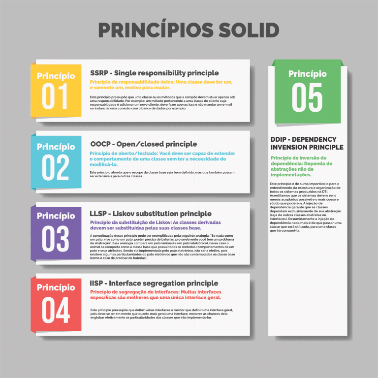

# S.O.L.I.D

O SOLID pode ser considerado por muito um **padrão de projeto** mas também pode ser
considerado uma filosófia de **escrita de código**. É uma forma de pensar na hora 
que você está escrevendo o seu projeto que te ajuda e muito a escrever códigos mais
limpos.

- O SOLID é mais voltado para arquitetura do projeto.
- CLEAN CODE são táticas de abordagem na hora da escrita ou refatoração do código.

O Clean Code são práticas mais pontuais que não levam em consideração a arquitetura
do projeto.

# 5 princípio do SOLID

Na linguagem do **javascript puro** é práticamente impossível usar o conceito
de SOLID não incluindo **typescript**.

Para o SOLID funcionar eu tenho que implementar todos os seus príncipios. Não
existe isso de SOLID sem implementar todos os seus príncipios.

- Príncipio da Responsabilidade única 

Esse princípio é possível usar 100% no javascript.

- Príncipio open/close

Sem interface esse princípio não da tanto resultado.
- Princípio de substituição de Liskov
Idem
- Princípio da segregação de interface 

No javascript puro não existe interface.
O princípio de segregação de interface sugere que uma classe
tenha mais de uma interface implementada, não tem como ter uma
classe com multiplas heranças no javascript.

- Inversão de dependência

Esse princípio só funciona bem em cima do princípio de segregação de interface.

O javascript é uma linguagem dinâmica e o SOLID para funcionar legal ele precisa
de *tipagem*. O SOLID foi um padrão criado 100% em cima de linguagem tipadas.

## Cultura do JS

O javascript não foi feito para ser uma linguagem tem classes que tem herança,
não foi feito para ser uma linguagem tipo c# ou java. Na plataforma que o javascript 
foi desenhado é muito mais simples fazer as coisas em funções soltas ou dentro
de objetos JSON do que criando uma classe e colocando herança.

O React passou anos criando componentes com classes só que era horrível e depois
de anos eles fizeram uma mudança mudando o padrão do react para os componentes
serem funções inves de classes.

Somente da pra usar SOLID no javascript utilizando **typescript**, o typescript
tem interface, tem herança multipla, tem tipos, tem decorators.