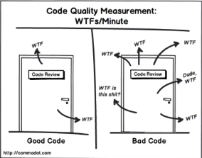
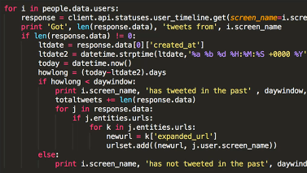
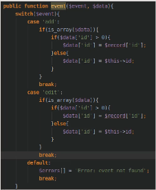
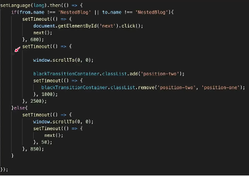

# O que é Clean Code

Clean Code ou código limpo refere-se a um conjunto de práticas estipulada pela comunidade
que  você pode aplicar no seu código para obter uma maior **legibilidade**
e **manutenabilidade** do seu código.

### Clean Code não é Clean Arch

- O **clean code** aborda a parte da escrita do código em si.

Ex: é a forma como você vai escrever uma função, uma classe, uma váriavel para você tornar aquele código escrito
mais legivél.

- **Clean Arch** já é uma série de padrões arquiteturais. 

# A Grande Realidade do trabalho como Dev!

Você passa a maior parte do tempo *lendo código* ao invés de *escrevendo código* tirando a excessão na onde você é
frelancer ou está começando um projeto do zero.

A grande demanda hoje em dia no mercado de trabalho de programação envolve mais 
**manutenção** e **evolução** de software ou seja desenvolver novas features em
softwares que já existem do que criar softwares do zero.

Quanto mais corporativo for a empresa que você vai estar trabalhando mais e mais
tempo você vai passar *lendo código* do que *escrevendo código*.

A escrita de um código é como se fosse a escrita de um texto, quando você escreve
um código sujo e como se você estivesse escrevendo um texto todo sem concordância
que as pessoas que forem ler ou até você no futuro vai ter dificuldade de entender.

Um código ruim vai atrapalhar você no futuro e o seus companheiros e isso pode tornar a sua equipe menos produtiva o que vai gerar transtornos no seu trabalho por isso é importante adotar o clean code.

# Qual é a REAL importância do Clean Code no Javascript?

- Dificuldade de resolver bugs
- O Gestor te passa uma tarefa, você diz que vai levar 2 dias para fazer, mas o código fonte ESTÁ EXTREMANTE ZOADO, e você na verdade leva 4 dias.
- Se você leva mais tempo para resolver uma tarefa por que o código está sujo, o custo do projeto fica mais caro.
- Geralmente, geralmente... código sujo gera software defeituoso, e se você produz código defeituoso, você vai ser taxado como um profissional ruim, e vai perder a vaga para um profissional melhor.
- 1 Hora refatorando código faz com que as pessoas economizem de 2 a 3 horas depois, em média.

# O Maior Indicativo de que um código está sujo
*A informação é a moeda que mais vale.*

O maior indicativo de que o código está sujo e precisar passar por uma refatoração é quando em um único bloco, função ou método você tem uma **profundidade de identação muito grande**.

Geralmente quando se tem identações muito profundas no seu código o que acontece
é que isso indica que você tem várias estruturas uma dentro da outra.

Muito comum encontrar esse tipo de código em aplicações com **ReactJS**.

# O que é refatoração?

Refatoração é o processo de modificar o código existente de um programa de maneira a melhorar sua estrutura e qualidade sem alterar sua funcionalidade. Isso pode incluir coisas como renomear variáveis, reorganizar o código em funções e módulos mais pequenos e remover código desnecessário.

A refatoração é importante porque o código de um programa muitas vezes é alterado e atualizado ao longo do tempo. Se o código não é bem estruturado e mantido, pode se tornar difícil de ler e entender, o que pode tornar a manutenção e a adição de novas funcionalidades muito mais difíceis. A refatoração ajuda a manter o código limpo e organizado, o que facilita a manutenção e a adição de novas funcionalidades no futuro.

### Como fazer refatoração

A refatoração é um processo iterativo que envolve várias etapas. Aqui estão algumas dicas para ajudá-lo a começar:

- Identifique áreas do código que precisam de refatoração. Isso pode incluir código confuso, repetitivo ou desorganizado. Faça anotações sobre o que precisa ser mudado e por quê.

- Crie um plano de refatoração. Determine quais alterações precisam ser feitas e como elas afetarão o código existente. Certifique-se de que o plano seja realista e viável.

- Execute o plano de refatoração. Faça as alterações de acordo com o plano e teste o código regularmente para garantir que a funcionalidade não seja afetada.

- Teste e depure o código refatorado. Execute testes de unidade e de integração para garantir que o código esteja funcionando corretamente e corrija quaisquer erros ou bugs encontrados.

- Documente as alterações. Crie comentários e documentação para explicação de cada regra de negócio.

# Clean Code é Hábito

Clean code é uma prática que deve ser aprendida e desenvolvida como um hábito. Escrever código limpo e organizado não é algo que se aprende de uma vez por todas; é uma habilidade que precisa ser cultivada e aprimorada com o tempo.

Ao adquirir o hábito de escrever código limpo, você poderá produzir código que seja mais fácil de ler e entender, além de facilitar a manutenção e a adição de novas funcionalidades no futuro. Além disso, o clean code pode ajudar a evitar erros e bugs em seu código, o que é crucial em projetos de software em constante mudança.

Não é suficiente apenas saber sobre o clean code; é preciso praticá-lo regularmente para torná-lo um hábito. Isso pode incluir coisas como seguir boas práticas de nomenclatura e estruturação de funções.

# Pilares

- Primeiro pilar: Variáveis Limpas
- Segundo pilar: Funções Limpas